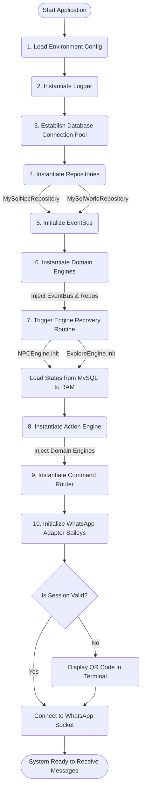

# Aetheria Boot Sequence

Diagram ini memandu urutan eksekusi inisialisasi pada saat aplikasi pertama kali dijalankan. Kompleksitas *startup* membutuhkan *dependency injection* berurutan agar tiap modul mendapat pasokan data dan kelas prasyaratnya dengan benar.

Jika terjadi _crash_ pada masa *startup*, perhatikan _log error_ untuk menemukan di titik mana *dependency* gagal disuntikkan atau koneksi tertolak.
