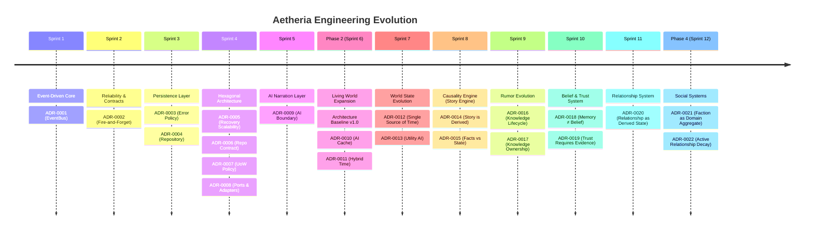

# 🗂️ Engineering Decision Index

Ini adalah direktori sentral dari seluruh **Architecture Decision Records (ADR)** yang mengatur *Aetheria*. Mulai dari *Aetheria v1.0 Architecture Baseline*, seluruh perubahan struktural yang melanggar batas *Domain*, *EventBus*, atau *AI* membutuhkan diskusi dan penerbitan ADR baru.

## 📋 Daftar ADR

| ADR | Topik | Status | Scope / Area | Deskripsi Singkat |
|:---:|---|:---:|---|---|
| **0001** | EventBus Pattern | Active | *Architecture Foundation* | Dunia berinteraksi murni melalui *Events* tanpa *Coupling* langsung antar *Engine*. |
| **0002** | Fire-and-Forget | Active | *EventBus Execution* | Event diproses asinkron; hanya urutan pemicuan (*Dispatch Order*) yang terjamin, bukan penyelesaiannya. |
| **0003** | Error Policy | Active | *Error Handling* | *Operational Error* dicatat di *Logger*; *Domain Error* (mengubah gameplay) ditembakkan sebagai *Event*. |
| **0004** | Repository Pattern | Active | *Database Access* | Menerapkan pemisahan mutlak (*Interface*) terhadap logika penyimpanan (SQL, SQLite, dll). |
| **0005** | Recovery Scalability | Active | *State Initialization* | Menerima strategi *Load All* saat ini, dengan mandat *Lazy Loading* ketika populasi dunia melebihi 500+ entitas. |
| **0006** | Repository Contract | Active | *Persistence Layer* | Semua fungsi Repositori wajib mengembalikan *Rich Result Object*, dilarang keras memakai `boolean`. |
| **0007** | Unit of Work Policy | Active | *Transaction Boundary* | `IUnitOfWork` dilarang digunakan untuk *query* tunggal demi menekan *overhead locking* *database*. |
| **0008** | Ports & Adapters | Active | *Architecture Boundary* | *Transport Never Enters Domain*. WhatsApp (JID, Soket) berhenti di lapisan terluar (*Adapter*). |
| **0009** | AI Boundary | Active | *AI Integration* | AI *hanyalah* narator (penerjemah teks fiksi), tidak berhak memutuskan atau mengubah statistik game (*Trust*, *Memory*). |
| **0010** | Future AI Cache | Proposed | *AI Optimization* | Wacana *Deterministic Prompt Hash* dan penyimpanan hasil narasi lokal (Cache) untuk efisiensi *token*. |
| **0011** | Hybrid World Time | Active | *World Simulation* | Waktu adalah konsep domain (`world.tick`). Dunia bergulir via kombinasi *Passive Tick* (Catch-up) dan *Active Tick* (Interval). |
| **0012** | Single Source of Time | Active | *World Simulation* | Hanya `WorldEngine` yang memiliki otoritas untuk memublikasikan event waktu (`world.tick`). |
| **0013** | Utility AI (Scoring) | Proposed| *NPC Behavior* | Evaluasi *Behavior* NPC didikte oleh utilitas kalkulus matematika, BUKAN oleh *Machine Learning* / LLM. |
| **0014** | Story is Derived, Never Authored | Active | *Story Engine* | Story Engine dan AI dilarang mencipta/merangkai cerita secara acak; cerita MURNI merupakan observasi dari fakta evolusi alam. |
| **0015** | Derived Facts vs World State | Active | *Story Engine* | *Story Event* tidak mengubah parameter *World State* secara langsung, melainkan harus ditindaklanjuti oleh *Consequence Evaluation*. |
| **0016** | Knowledge Lifecycle | Active | *Rumor Engine* | Evolusi informasi mematuhi siklus deterministik: Story Event -> Rumor Created -> Spread -> Memory -> Decay -> Forgotten. |
| **0017** | Knowledge Ownership | Active | *Architecture* | Tidak ada intervensi antar-engine: World memiliki fakta, Rumor memiliki tren global, NPC memiliki memori. |
| **0018** | Memory ≠ Belief | Active | *NPC Engine* | Mengetahui (Memory) bukan berarti mempercayai (Belief). Belief dievaluasi oleh Rule Engine berdasarkan Trust, bukan oleh AI. |
| **0019** | Trust Requires Evidence | Active | *Trust System* | Reputasi/Trust antar-NPC hanya berubah melalui diverifikasinya bukti konkrit dari semesta (Outcome), BUKAN karena persuasi obrolan belaka. |
| **0020** | Relationship as Derived State | Active | *Relationship System* | Label sosial (Rival, Enemy, Friend) tidak disimpan sebagai state permanen, melainkan merupakan kalkulasi dinamis (derived state) dari dimensi relasi dan riwayat kejadian. |
| **0021** | Faction as Domain Aggregate | Active | *Social Layer* | Faction adalah entitas agregat terpisah yang memegang reputasi kolektif, bukan tag dan bukan Super-NPC. |
| **0022** | Active Relationship Decay | Active | *Relationship System* | Peluruhan/Decay hubungan berjalan secara deterministik dan aktif dipicu oleh event bergantinya hari, bukan kalkulasi malas (lazy). |

---

## 📈 Architecture Decision Timeline
*Visualisasi Evolusi Keputusan Arsitektural Aetheria:*

